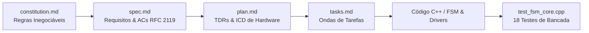
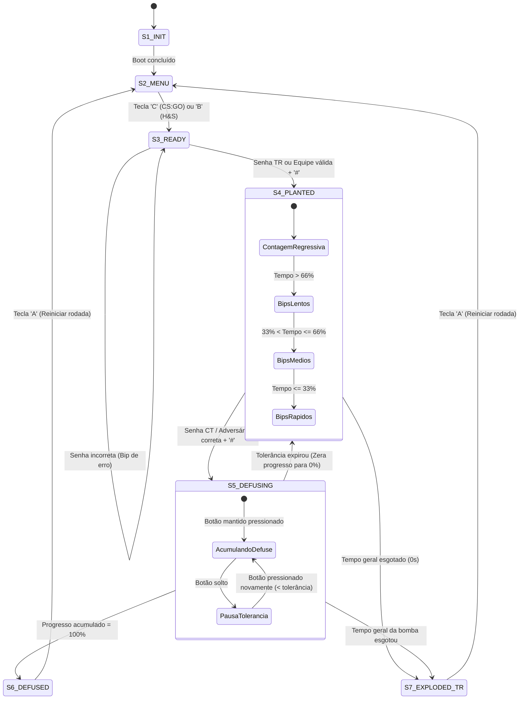

# 💣 C4 Airsoft Replica — Firmware ESP32

[](https://platformio.org/)
[](https://www.arduino.cc/)
[](https://isocpp.org/)
[](#-metodologia-spec-driven-development-sdd)
[-brightgreen.svg)](#-testes-automatizados-de-bancada)
[](LICENSE)

> Firmware de alta fidelidade e tempo real para prop de jogo cenográfico de **Airsoft (C4)** baseado no microcontrolador **ESP32**, desenvolvido sob a metodologia **Spec-Driven Development (SDD)** no âmbito do Mestrado Profissional em Computação / Engenharia — Disciplina de **Produtos Intensivos de Software (PIS)** no **Instituto Federal Fluminense (IFF)**.

---

## 📋 Sumário
- [Visão Geral](#-visão-geral)
- [Funcionalidades Principais](#-funcionalidades-principais)
- [Modos de Jogo](#-modos-de-jogo)
  - [1. Modo Clássico CS:GO](#1-modo-clássico-csgo)
  - [2. Modo Hide and Seek (Achar e Demolir)](#2-modo-hide-and-seek-achar-e-demolir)
- [Metodologia Spec-Driven Development (SDD)](#-metodologia-spec-driven-development-sdd)
- [Arquitetura de Software e Máquina de Estados (FSM)](#-arquitetura-de-software-e-máquina-de-estados-fsm)
- [Pinagem e Mapeamento de Hardware](#-pinagem-e-mapeamento-de-hardware)
- [Interface Web de Configuração & NVS](#-interface-web-de-configuração--nvs)
- [Compilação, Gravação e Uso](#-compilação-gravação-e-uso)
- [Testes Automatizados de Bancada](#-testes-automatizados-de-bancada)
- [Estrutura do Repositório](#-estrutura-do-repositório)
- [Critérios de Aceite (ACs)](#-critérios-de-aceite-acs)

---

## 🎯 Visão Geral

O projeto consiste na modernização arquitetural e refatoração integral de um prop de bomba cenográfica para simulação tática esportiva de Airsoft. O firmware substitui arquiteturas legadas bloqueantes baseadas em loops com `delay()` por uma **Máquina de Estados Finitos (FSM) determinística e cooperativa baseada em `millis()`**, acoplada a drivers modulares com injeção de dependência e persistência não-volátil em memória flash (**NVS**).

O prop interage com os operadores através de:
- **Teclado Matricial 4x4** (inserção de senhas com tecla `#` de confirmação e tecla `A` de limpeza/reset);
- **Display LCD 16x2 I2C** (apresentação de menus, tempos de contagem regressiva, prompts e feedbacks);
- **Buzzer Piezoelétrico Ativo** (cadências acústicas escalonadas de urgência a 4.200 Hz e bips de teclado a 3.000 Hz);
- **Fita de LEDs Endereçáveis WS2812B (Neopixel)** (sinalização luminosa de 360° a 100% de brilho);
- **Botão Físico de Defuse** (acionamento mantido com temporizador de tolerância e cancelamento integral);
- **Ponto de Acesso Wi-Fi + Servidor Web HTTP** (ajuste dinâmico de senhas, tempos e preferências).

---

## ✨ Funcionalidades Principais

- ⏱️ **Multitarefa Cooperativa Sem Bloqueios:** Execução em taxa de amostragem constante sem chamadas a `delay()`, garantindo que contagem regressiva, leitura de botões, varredura de teclado e animações ocorram em paralelo sem perda de eventos (*jitter* < 1 ms).
- 🔒 **Validação Estrita de Senhas:** Rejeição rigorosa de dígitos excedentes (evita ataques ou armações acidentais por digitação incorreta).
- 🛡️ **Ciclo de Vida de Defuse Robusto:** Isolamento completo de acumuladores de tempo entre rodadas consecutivas; soltura do botão fora da tolerância reseta o progresso para 0% e exige nova autenticação no teclado.
- 🌐 **Web Server Embutido:** Ponto de acesso Wi-Fi próprio (`C4_BOMB_CONFIG`) com interface web responsiva em *Dark Mode* para alterar parâmetros sem necessidade de recompilação.
- 💾 **Persistência Não-Volátil (NVS):** Todas as configurações de senhas, tempos e preferências de máscara de display permanecem salvas na partição flash do ESP32 via API `Preferences`.
- 🧪 **Testabilidade Desktop Total:** 100% da lógica da FSM e regras de negócio podem ser compiladas e validadas nativamente no Linux via GCC sem necessidade do microcontrolador físico plugado.

---

## 🎮 Modos de Jogo

### 1. Modo Clássico CS:GO
Inspirado na clássica mecânica competitiva de *Counter-Strike*:
1. **Seleção:** Tecla `C` no menu inicial (`S2_MENU`).
2. **Armação:** O operador Terrorista (TR) insere a senha (padrão `73556`) e confirma com `#`.
3. **Contagem Regressiva (45s padrão):** 
   - **1º Terço (> 30s):** Bips lentos a 1 Hz sincronizados com piscadas vermelhas do LED.
   - **2º Terço (15s a 30s):** Bips médios a 2 Hz com piscadas a 2 Hz.
   - **3º Terço (≤ 15s):** Bips rápidos a 4 Hz com urgência máxima.
4. **Desarme (CT):**
   - **Desarme Normal:** Digita a senha CT (padrão `12345`) + `#` e mantém o botão físico pressionado por **10 segundos**.
   - **Desarme com Kit:** Digita a senha com Kit (padrão `1234`) + `#` e mantém o botão físico pressionado por apenas **5 segundos**.
   - **Janela de Tolerância:** Se o operador soltar o botão de defuse e a tolerância configurada expirar (padrão 5s, ajustável de 0 a 30s), o progresso é **zerado (0%)**, a bomba volta ao estado de contagem armada e **obriga a digitar a senha novamente**.
5. **Vitória:**
   - **Detonação:** Se o tempo da bomba esgotar, vitória TR (tom contínuo a 4.200 Hz, LEDs em amarelo sólido).
   - **Desarme:** Se o tempo de defuse atingir 100%, vitória CT (bip duplo de confirmação, LEDs em azul sólido).

---

### 2. Modo Hide and Seek (Achar e Demolir)
Modo alternativo e dinâmico para operações de busca e proteção de território:
1. **Seleção:** Tecla `B` no menu inicial.
2. **Início:** A C4 é escondida no campo por um operador neutro ou juiz.
3. **Plantio Competitivo Bidirecional:** Qualquer equipe que encontrar o artefato pode armá-lo:
   - **Time Azul:** Digita a senha de plantio azul (padrão `1111`) + `#`. O LED passa a pulsar em **Azul**.
   - **Time Vermelho:** Digita a senha de plantio vermelho (padrão `3333`) + `#`. O LED passa a pulsar em **Vermelho**.
4. **Objetivos Cruzados:**
   - A equipe plantadora deve **proteger** a C4 até que o cronômetro chegue ao fim (gerando sua vitória).
   - A equipe adversária deve **desarmar** a C4 antes da explosão para vencer a partida.
5. **Desarme Cruzado Estrito:**
   - Se plantada pelo Azul &rarr; Requer estritamente a senha de desarme do **Time Vermelho** (padrão `4444`) + `#` e botão mantido.
   - Se plantada pelo Vermelho &rarr; Requer estritamente a senha de desarme do **Time Azul** (padrão `2222`) + `#` e botão mantido.
   - Senhas da própria equipe plantadora ou incorretas são imediatamente rejeitadas com tom de erro.

---

## 🏛️ Metodologia Spec-Driven Development (SDD)

Este firmware foi concebido utilizando o ciclo de vida rigoroso do **Spec-Driven Development**:



1. **[constitution.md](constitution.md):** Estabelece leis fundamentais de arquitetura: laço não-bloqueante via `millis()`, drivers desacoplados com injeção de dependência (`KeypadDriver`, `ButtonDriver`, `BuzzerDriver`, `LedDriver`, `DisplayDriver`), proibição de variáveis globais mágicas e isolamento da camada de hardware com `#ifdef ARDUINO`.
2. **[spec.md](spec.md):** Especificação funcional com histórias de usuário, tabela de transições de estados e 20 Critérios de Aceite (**AC-01 a AC-20**) formulados sob a norma RFC 2119.
3. **[plan.md](plan.md):** Decisões Técnicas de Projeto (*Technical Design Rules - TDRs*), diagrama de blocos de componentes e matriz de rastreabilidade.
4. **[tasks.md](tasks.md):** Plano de tarefas sequencial subdividido em 8 Ondas (*Ondas 1 a 8*), com checklist rastreável de cada entrega e refatoração.

---

## 🔄 Arquitetura de Software e Máquina de Estados (FSM)

A lógica central do firmware é orquestrada pela classe `C4GameFSM`, implementada como um autômato finito determinístico:



---

## 🔌 Pinagem e Mapeamento de Hardware

A pinagem foi definida conforme a especificação do documento de interface física (**C4A-ICD-001**) e mantida de forma imutável em [`include/c4_pins.h`](include/c4_pins.h):

| Periférico | Função de Hardware | Pino ESP32 | Nível Lógico / Protocolo | Observações Técnicas |
| :--- | :--- | :---: | :---: | :--- |
| **Buzzer Piezo** | Emissor de bips e alertas | **GPIO 4** | Ativo Alto / PWM | Onda quadrada de 4.200 Hz (alarme) e 3.000 Hz (teclas) |
| **Fita LED WS2812B** | Iluminação 360° (Neopixel) | **GPIO 13** | Dados seriais FastLED | 30 LEDs, 100% de brilho (255) |
| **Botão de Defuse** | Entrada táctil mantida | **GPIO 14** | Ativo Baixo (Pull-up interno) | Debounce digital de 30 ms |
| **Teclado 4x4 (Row 1)** | Linha 1 da matriz matricial | **GPIO 16** (RX2) | Saída digital varredura | Teclas: `1`, `2`, `3`, `A` |
| **Teclado 4x4 (Row 2)** | Linha 2 da matriz matricial | **GPIO 17** (TX2) | Saída digital varredura | Teclas: `4`, `5`, `6`, `B` |
| **Teclado 4x4 (Row 3)** | Linha 3 da matriz matricial | **GPIO 18** | Saída digital varredura | Teclas: `7`, `8`, `9`, `C` |
| **Teclado 4x4 (Row 4)** | Linha 4 da matriz matricial | **GPIO 19** | Saída digital varredura | Teclas: `*`, `0`, `#`, `D` |
| **Teclado 4x4 (Col 1)** | Coluna 1 da matriz matricial | **GPIO 23** | Entrada (Pull-up interno) | Teclas: `1`, `4`, `7`, `*` |
| **Teclado 4x4 (Col 2)** | Coluna 2 da matriz matricial | **GPIO 25** | Entrada (Pull-up interno) | Teclas: `2`, `5`, `8`, `0` |
| **Teclado 4x4 (Col 3)** | Coluna 3 da matriz matricial | **GPIO 26** | Entrada (Pull-up interno) | Teclas: `3`, `6`, `9`, `#` |
| **Teclado 4x4 (Col 4)** | Coluna 4 da matriz matricial | **GPIO 27** | Entrada (Pull-up interno) | Teclas: `A`, `B`, `C`, `D` |
| **Display LCD 16x2** | I2C Serial Data (SDA) | **GPIO 21** | I2C Bidirecional | Endereço padrão `0x27` (fallback `0x3F`) |
| **Display LCD 16x2** | I2C Serial Clock (SCL) | **GPIO 22** | I2C Clock | Frequência 100 kHz |
| **Expansão Futura** | Reserva V2 (RFID / Queda) | **GPIO 32** | Livre | - |
| **Expansão Futura** | Reserva V2 (Buzzer 2) | **GPIO 33** | Livre | - |

---

## 🌐 Interface Web de Configuração & NVS

O firmware inicializa automaticamente um Access Point autônomo com servidor HTTP embutido:

- **Rede Wi-Fi (SSID):** `C4_BOMB_CONFIG`
- **Senha da Rede:** `12345678`
- **Endereço de Acesso:** `http://192.168.4.1`

### Parâmetros Configuráveis via Web:
| Parâmetro | Campo HTML | Valor Padrão | Faixa Válida | Descrição |
| :--- | :---: | :---: | :---: | :--- |
| **Senha TR (Armar CS:GO)** | `sa` | `73556` | 1 a 16 chars | Código para armar no modo CS:GO |
| **Senha CT (Desarme Normal)** | `sd` | `12345` | 1 a 16 chars | Código para desarme sem kit (10s) |
| **Senha Kit (Desarme Rápido)** | `sk` | `1234` | 1 a 16 chars | Código para desarme com kit (5s) |
| **Time Azul - Armar (H&S)** | `taa` | `1111` | 1 a 16 chars | Código para armação pelo Time Azul |
| **Time Azul - Defusar (H&S)** | `tad` | `2222` | 1 a 16 chars | Código para desarme do Time Azul (se Vermelho armou) |
| **Time Vermelho - Armar (H&S)** | `tva` | `3333` | 1 a 16 chars | Código para armação pelo Time Vermelho |
| **Time Vermelho - Defusar (H&S)** | `tvd` | `4444` | 1 a 16 chars | Código para desarme do Time Vermelho (se Azul armou) |
| **Tempo de Contagem da Bomba** | `tb` | `45` | 5 a 999 s | Tempo total até a explosão |
| **Tempo de Desarme Normal** | `tdn` | `10` | 1 a 99 s | Tempo necessário de botão mantido sem kit |
| **Tempo de Desarme com Kit** | `tdk` | `5` | 1 a 99 s | Tempo necessário de botão mantido com kit |
| **Tolerância ao Soltar Botão** | `ttol` | `5` | 0 a 30 s | Janela de carência ao soltar botão (0s = imediato) |
| **Máscara de Senha no LCD** | `mask` | `Marcado (*)` | Booleano | Exibe asteriscos (`*`) ou texto legível na digitação |

---

## 🚀 Compilação, Gravação e Uso

### Pré-requisitos
- [Visual Studio Code](https://code.visualstudio.com/) com a extensão [PlatformIO IDE](https://platformio.org/platformio-ide) instalada, **OU**
- [PlatformIO Core (CLI)](https://docs.platformio.org/en/latest/core/index.html).

### 1. Compilação do Firmware
```bash
pio run
```

### 2. Gravação no ESP32
Conecte o ESP32 via cabo micro-USB / Type-C e execute:
```bash
pio run --target upload
```

### 3. Monitor Serial (Depuração)
```bash
pio device monitor -b 115200
```

---

## 🧪 Testes Automatizados de Bancada

Uma das maiores vantagens da arquitetura modular SDD deste projeto é a capacidade de rodar testes de integração e regras de negócio no próprio computador host, compilando a suite C++17 com o GCC nativo:

```bash
# Compilar e executar a suite nativa de 18 testes
g++ -std=c++17 -Wall -Wextra -I include \
    test/test_fsm_core.cpp \
    src/game_fsm.cpp \
    src/keypad_driver.cpp \
    src/button_driver.cpp \
    src/buzzer_driver.cpp \
    src/led_driver.cpp \
    src/display_driver.cpp \
    src/web_server_manager.cpp \
    -o test_fsm && ./test_fsm
```

### Resultado da Validação Automatizada (100% de Conformidade):
```text
========================================================
  SUITE DE TESTES NATIVOS DE BANCA: C4 AIRSOFT FSM CORE  
  VALIDACAO DE CRITERIOS DE ACEITE (AC-01 A AC-20)      
========================================================
Executando test_plant_with_correct_tr_password_and_enter... [PASSOU]
Executando test_plant_with_invalid_password_rejection... [PASSOU]
Executando test_keypad_buffer_clear_with_key_a... [PASSOU]
Executando test_buzzer_cadence_three_tiers... [PASSOU]
Executando test_defuse_tolerance_window_preserved... [PASSOU]
Executando test_defuse_penalty_above_half_preserved_at_fifty_percent... [PASSOU]
Executando test_defuse_penalty_below_half_reset_to_zero... [PASSOU]
Executando test_explosion_precedence_over_active_defuse... [PASSOU]
Executando test_defuse_successful_ct_victory... [PASSOU]
Executando test_defuse_with_kit_password... [PASSOU]
Executando test_password_display_mask_and_cleartext... [PASSOU]
Executando test_defuse_rejection_with_extra_digits... [PASSOU]
Executando test_defuse_zero_tolerance_immediate_cancel... [PASSOU]
Executando test_defuse_custom_tolerance_window... [PASSOU]
Executando test_hs_blue_plant_and_blue_victory_by_explosion... [PASSOU]
Executando test_hs_blue_plant_and_red_victory_by_defuse... [PASSOU]
Executando test_hs_red_plant_and_blue_victory_by_defuse... [PASSOU]
Executando test_consecutive_rounds_defuse_accumulator_reset... [PASSOU]
========================================================
Resultado: 18/18 testes passaram.
[SUCESSO] Todos os 18 testes passaram com 100% de conformidade!
```

---

## 📂 Estrutura do Repositório

```text
.
├── constitution.md           # Leis inegociáveis de arquitetura de software e governança
├── spec.md                   # Especificação formal funcional, diagramas e Critérios de Aceite
├── plan.md                   # Decisões de design técnico (TDRs), mapeamento de subsistemas e ICD
├── tasks.md                  # Backlog de engenharia decomposto em 8 Ondas rastreáveis
├── platformio.ini            # Arquivo de configuração de compilação e dependências do PlatformIO
├── include/                  # Cabeçalhos e interfaces públicas C++
│   ├── button_driver.h       # Driver com debounce digital para o botão de defuse
│   ├── buzzer_driver.h       # Gerador de cadências sonoras não-bloqueantes
│   ├── c4_config.h           # Constantes padrão, temporizadores e structs de configuração
│   ├── c4_pins.h             # Mapeamento oficial imutável de pinos do ESP32 DevKit v1
│   ├── c4_types.h            # Enums fortemente tipados (GameState, GameMode, Team, etc.)
│   ├── display_driver.h      # Driver de renderização de telas no LCD 16x2 I2C
│   ├── game_fsm.h            # Controlador central da Máquina de Estados Finitos (FSM)
│   ├── keypad_driver.h       # Driver do teclado matricial 4x4 com buffer estrito
│   ├── led_driver.h          # Controlador dos padrões luminosos da fita WS2812B
│   └── web_server_manager.h  # Servidor Web HTTP, rotas e gerenciador de persistência NVS
├── src/                      # Implementação dos módulos C++
│   ├── button_driver.cpp
│   ├── buzzer_driver.cpp
│   ├── display_driver.cpp
│   ├── game_fsm.cpp
│   ├── keypad_driver.cpp
│   ├── led_driver.cpp
│   ├── main.cpp              # Ponto de entrada do firmware (setup e loop cooperativo)
│   └── web_server_manager.cpp
└── test/
    └── test_fsm_core.cpp     # Suite nativa completa de 18 testes de bancada
```

---

## 📜 Critérios de Aceite (ACs)

O firmware atende 100% dos critérios formais de aceite especificados sob a norma RFC 2119 em [`spec.md`](spec.md):
- **AC-01 (Seleção de Modo):** Inicialização estrita em `S2_MENU` aguardando seleção por tecla `C` ou `B`.
- **AC-02 (Buffer e Limpeza):** Tecla `'A'` esvazia imediatamente o buffer de entrada do teclado.
- **AC-03 (Validação Estrita de Senha):** Correspondência exata da senha configurada; dígitos excedentes causam rejeição imediata.
- **AC-04 (Escalonamento de Bips):** 3 patamares sonoros de urgência escalonados nos marcos de 2/3 e 1/3 do tempo da bomba.
- **AC-05 (Sincronismo Visual e Sonoro):** Fita LED pulsa simultaneamente ao buzzer na cor adequada da rodada.
- **AC-06 (Condição de Entrada no Defuse):** Exige validação de senha CT com tecla `'#'` antes de permitir acúmulo de tempo de defuse.
- **AC-07 (Manutenção do Botão de Defuse):** O tempo de desarme progride exclusivamente enquanto o botão estiver ativamente pressionado.
- **AC-08 (Janela de Tolerância Configurável):** Respeito à tolerância configurada (0 a 30s) ao soltar o botão de defuse.
- **AC-09 (Reset Integral ao Expirar Tolerância):** Ao expirar a tolerância (ou se tolerância = 0s), o progresso zera para 0%, retorna para `S4_PLANTED` e exige nova inserção de senha pelo CT.
- **AC-10 (Precedência da Explosão):** A detonação da bomba por tempo geral esgotado anula desarmes incompletos instantaneamente.
- **AC-11 (Feedback de Vitória CT):** LED em Azul sólido e mensagem de vitória CT ao desarmar.
- **AC-12 (Feedback de Vitória TR):** LED em Amarelo sólido e tom contínuo ao detonar.
- **AC-13 (Interface Web e Persistência NVS):** Configuração autônoma via Wi-Fi AP e armazenamento seguro na flash via `Preferences`.
- **AC-14 (Submissão com '#' e Limpeza com 'A'):** Senha validada somente após tecla `'#'`; tecla `'A'` limpa caracteres e reseta telas finais.
- **AC-15 (Configuração de Máscara de Senha):** Suporte configurável para exibir senha em claro ou como asteriscos (`*`).
- **AC-16 (Frequências Acústicas do Buzzer):** Tons piezoelétricos exatos: 4.200 Hz (contagem), 3.000 Hz (teclas) e 200 Hz (erro).
- **AC-17 (Brilho Integral dos LEDs):** Fita WS2812B a 100% de brilho (255) para visibilidade diurna em campos abertos.
- **AC-18 (H&S Plantio Bidirecional):** Suporte à armação independente tanto pelo Time Azul quanto pelo Time Vermelho.
- **AC-19 (H&S Desarme Cruzado Estrito):** Apenas a equipe adversária possui a senha autorizada para desarmar a C4.
- **AC-20 (H&S Sinalização Luminosa e Vitória):** Sinalização na cor da equipe plantadora durante a contagem e premiação visual ao vencedor da rodada.

---

## 👨‍💻 Autores e Informações Acadêmicas

- **Instituição:** Instituto Federal de Educação, Ciência e Tecnologia Fluminense (IFF)
- **Programa:** Mestrado Profissional
- **Disciplina:** Produtos Intensivos de Software (PIS)
- **Projeto:** C4 Airsoft Prop Replica — Especificação e Desenvolvimento Guiado por Modelos (SDD)
