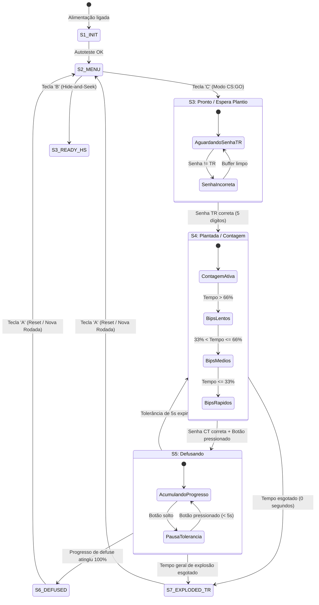

# Functional Specification: C4 Airsoft Firmware

**Projeto:** C4 Airsoft — Produto Intensivo de Software (PIS)  
**Documento:** `spec.md` (Especificação Funcional do Sistema)  
**Autor:** Human Authored / AI Refined  
**Fase SDD:** 2 de 6 (Specify: The What & Why)  
**Impacto a Jusante:** Contrato de Requisitos e Comportamento Funcional  
**Documentos de Origem:** `C4A-DES-001` (Descritivo v1.0), `C4A-PB-001` (Backlog v2.0), `C4A-ICD-001` (ICD v1.0)

---

## 1. Visão Geral e Propósito do Sistema

O **C4 Airsoft** é um dispositivo cenográfico eletrônico programável, projetado para servir como objetivo tático interativo em partidas de airsoft. O produto replica a dinâmica de jogos eletrônicos táticos como *Counter-Strike*, onde uma equipe tenta plantar e detonar cenograficamente o artefato e a equipe adversária deve localizá-lo e desarmá-lo (*defuse*) antes do término da contagem regressiva.

Este documento formaliza o **"O Quê"** e o **"Porquê"** do sistema, eliminando ambiguidades conceituais antes de qualquer planejamento arquitetural ou geração de código, respeitando a regra do SDD de não misturar pseudo-código ou detalhes de implementação nesta camada.

---

## 2. Histórias de Usuário (*User Stories*)

### US-01: Plantio Tático pelo Atacante (TR)
- **Como** jogador do time atacante (Terrorista / TR),
- **Quero** transportar o artefato até a área de objetivo (*bombsite*) e inserir uma senha de 5 dígitos no teclado matricial,
- **Para que** a C4 seja armada e inicie a contagem regressiva, obrigando o time adversário a intervir sob pressão de tempo.

### US-02: Percepção de Pressão e Tempo pelos Jogadores
- **Como** jogador em campo (atacante ou defensor),
- **Quero** ouvir bips sonoros e ver padrões de luz na fita LED cuja frequência aumente conforme o tempo de explosão se esgota,
- **Para que** eu possa avaliar a urgência tática mesmo à distância ou abrigado atrás de obstáculos.

### US-03: Desarme Tático pelo Defensor (CT)
- **Como** jogador do time defensor (Contra-Terrorista / CT),
- **Quero** localizar a C4 plantada, digitar a senha de desarme no teclado e manter pressionado o botão de defuse durante todo o tempo necessário,
- **Para que** a contagem seja interrompida e meu time vença a rodada.

### US-04: Tolerância a Conflitos e Retomada de Defuse
- **Como** defensor realizando o desarme sob fogo inimigo,
- **Quero** poder soltar temporariamente o botão de defuse por até 5 segundos para revidar ou me reposicionar,
- **Para que** o progresso do desarme não seja totalmente perdido instantaneamente por uma interrupção momentânea.

### US-05: Determinação Clara do Vencedor da Rodada
- **Como** participante ou juiz da partida,
- **Quero** que o dispositivo indique inequivocamente quem venceu a rodada (Azul para CT, Amarelo para TR) através da fita LED, display e buzzer,
- **Para que** não ocorram disputas ou dúvidas sobre o desfecho da rodada.

### US-06: Configuração e Seleção de Modos pelo Organizador
- **Como** organizador da partida de airsoft,
- **Quero** ligar o dispositivo e selecionar facilmente pelo menu entre o modo clássico "CS:GO" e o modo alternativo "Hide-and-Seek",
- **Para que** a partida possa ser iniciada rapidamente com regras claras e parâmetros validados.

---

## 3. Delimitação de Escopo (*Scope Boundaries*)

```
┌────────────────────────────────────────────────────────────────────────┐
│                          FRONTEIRA DE ESCOPO                           │
├──────────────────────────────────┬─────────────────────────────────────┤
│        DENTRO DO ESCOPO          │         FORA DO ESCOPO              │
│            (MVP V1)              │           (ROADMAP V2)              │
├──────────────────────────────────┼─────────────────────────────────────┤
│ • Modo CS:GO completo:           │ • Módulo físico RFID / Kit Defuse   │
│   Menu -> Plantio -> Contagem    │ • Interface Web/Wi-Fi em tempo real │
│   -> Defuse -> Vencedor          │ • Sensor acelerômetro de queda      │
│ • Validação de senha de 5 dígitos│ • Modos avançados de múltiplos bombs│
│ • Tecla 'A' para limpar buffer   │ • Servidor centralizado de placar   │
│ • Teclas 'B' e 'C' no Menu       │ • Homologação comercial externa     │
│ • Bips em 3 terços de tempo      │ • Qualquer ignição ou pirotecnia    │
│ • Botão mantido + janela de 5s   │                                     │
│ • Cores: Azul (CT), Amarelo (TR) │                                     │
└──────────────────────────────────┴─────────────────────────────────────┘
```

### 3.1 Dentro do Escopo (MVP V1)
1. Ciclo de vida completo do modo CS:GO: Menu inicial, Estado Pronto, Estado Plantada, Estado Defusando, Estado Defusada (Vitória CT) e Estado Fim TR (Vitória TR).
2. Interface de entrada por teclado matricial 4x4: entrada numérica de senhas de 5 dígitos e função da tecla `A` para limpeza do buffer.
3. Seleção de modo no menu inicial: tecla `C` para CS:GO e tecla `B` para Hide-and-Seek.
4. Sinalização sonora progressiva pelo buzzer: frequência de bips cadenciada em 3 patamares (1º terço, 2º terço e terço final da contagem regressiva).
5. Feedback visual dinâmico pela fita LED WS2812B: pulso sincronizado com o buzzer, cor Vermelha durante a contagem, cor Azul para vitória CT e cor Amarela para vitória TR.
6. Display LCD 16x2 I2C exibindo instruções de navegação, status atual, tempo restante e barra/percentual de progresso de defuse.
7. Mecânica de desarme híbrida: validação prévia de senha CT seguida de manutenção contínua do botão físico pressionado.
8. Regra de tolerância de desarme: desengate do botão permite retorno em até 5 segundos; decorrido esse prazo, aplica-se penalidade de progresso.
9. Ciclo de vida completo do modo Hide and Seek (H&S): armação por Time Azul ou Time Vermelho, proteção até detonação com vitória do time que armou, ou desarme cruzado pelo time adversário com vitória da equipe que desarmou.

### 3.2 Fora do Escopo (Roadmap / Fases Futuras)
1. Leitura física de tags RFID como multiplicador ou acelerador de defuse (reservado para V2).
2. Servidor web embarcado via Wi-Fi do ESP32 para telemetria em tempo real (planejado para V2).
3. Integração de sensor de movimento/queda (acelerômetro) para detectar C4 caída no solo.
4. Qualquer mecanismo de dispersão de fumaça, som de tiro real, ignição ou efeitos pirotécnicos.

---

## 4. Comportamento e Máquina de Estados Funcional

O ciclo operacional do software obedece a 8 estados lógicos formais:



### 4.1 Tabela de Transições e Regras de Negócio

| Estado Atual | Evento de Entrada | Próximo Estado | Comportamento Audiovisual e Saídas |
| :--- | :--- | :--- | :--- |
| **S1: Inicialização** | Boot do firmware concluído | **S2: Menu** | LCD exibe "C4 AIRSOFT v1.0", fita LED pisca branco brevemente e inicializa periféricos. |
| **S2: Menu Inicial** | Tecla `C` pressionada | **S3: Pronto (CS:GO)** | LCD: "CS:GO SELECIONADO / INSIRA SENHA TR". LEDs apagados em espera. |
| **S2: Menu Inicial** | Tecla `B` pressionada | **S3: Pronto (H&S)** | LCD: "HIDE AND SEEK / MODO ATIVADO". LEDs em cor neutra. |
| **S3: Pronto** | Senha TR digitada incorreta | **S3: Pronto** | LCD: "SENHA INVALIDA", bip de erro curto (200ms tom grave), buffer limpo. |
| **S3: Pronto** | Senha TR digitada correta (5 dig.) | **S4: Plantada** | Bip longo de armação (1000ms), LCD: "BOMB PLANTED", inicia contagem regressiva de 45s. |
| **S4: Plantada** | Tempo restante > 30s (1º terço) | **S4: Plantada** | Buzzer emite 1 bip por segundo (1 Hz); LED vermelho pisca a 1 Hz; LCD mostra `TIME: 00:XX`. |
| **S4: Plantada** | 15s < Tempo restante <= 30s (2º terço) | **S4: Plantada** | Buzzer emite 2 bips por segundo (2 Hz); LED vermelho pisca a 2 Hz; LCD atualiza tempo. |
| **S4: Plantada** | Tempo restante <= 15s (3º terço) | **S4: Plantada** | Buzzer emite 4 bips por segundo (4 Hz); LED vermelho pisca a 4 Hz; urgência máxima. |
| **S4: Plantada** | Senha CT correta inserida | **S5: Defusando** | Se botão de defuse estiver pressionado, inicia acumulação de tempo de defuse (10s total). |
| **S4: Plantada** | Tempo restante atinge 0s | **S7: Fim TR** | Simulação de explosão: tom contínuo / padrão sonoro de fim, LED amarelo fixo, LCD: "TERRORISTS WIN". |
| **S5: Defusando** | Botão mantido até 100% (10s) | **S6: Defusada** | Bip duplo de sucesso, LED azul fixo brilhante, LCD: "BOMB DEFUSED / CTS WIN". |
| **S5: Defusando** | Botão solto durante defuse | **S5: Defusando (Pausa)** | Interrompe contagem de defuse e inicia timer de tolerância de 5 segundos. LCD: "DEFUSE PAUSADO". |
| **S5: Defusando** | Botão pressionado novamente (< 5s) | **S5: Defusando** | Retoma acúmulo de tempo de defuse do ponto em que parou. Cancela timer de tolerância. |
| **S5: Defusando** | Tolerância expirada | **S4: Plantada** | Zera o progresso acumulado (0%). Exige nova inserção de senha CT para reiniciar desarme do zero. |
| **S5: Defusando** | Tempo geral atinge 0s durante defuse | **S7: Fim TR** | Prioridade do tempo geral: explosão cenográfica tem precedência sobre desarme incompleto. |
| **S6 / S7: Fim** | Tecla `A` pressionada | **S2: Menu** | Reinicia máquina de estados para novo ciclo de jogo, limpando buffers e temporizadores. |

---

## 5. Critérios de Aceite (*Acceptance Criteria - RFC 2119*)

Os seguintes critérios são condições binárias e verificáveis de sucesso para validação do software:

- **AC-01 (Seleção de Modo):** Ao ligar o equipamento, o sistema **MUST** permanecer no estado `S2: Menu` até que a tecla `C` ou `B` seja pressionada no teclado 4x4.
- **AC-02 (Buffer e Limpeza):** Ao pressionar a tecla `A` no teclado durante a digitação de senha, o sistema **MUST** esvaziar imediatamente o buffer de entrada e atualizar a linha do display.
- **AC-03 (Validação Estrita de Senha):** O sistema **MUST** exigir correspondência estrita e exata com a senha configurada. Dígitos adicionais excedentes (como digitar "123456" para a senha "12345") **MUST NOT** ser truncados ou ignorados e **MUST** resultar em senha inválida.
- **AC-04 (Escalonamento de Bips):** Durante o estado `S4: Plantada`, o software **MUST** alterar a frequência de acionamento do buzzer e da fita LED nos marcos exatos de 2/3 e 1/3 do tempo total de contagem.
- **AC-05 (Sincronismo Visual e Sonoro):** A cada bip emitido pelo buzzer no estado `S4`, a fita LED **MUST** piscar simultaneamente na cor Vermelha com duração de pulso correspondente.
- **AC-06 (Condição de Entrada no Defuse):** O sistema **MUST** exigir a validação bem-sucedida e exata da senha CT antes de permitir que o pressionamento do botão físico acumule tempo de desarme.
- **AC-07 (Manutenção do Botão de Defuse):** O tempo de desarme **MUST** progredir exclusivamente enquanto o botão físico de defuse mantiver o nível lógico ativo (pressionado).
- **AC-08 (Janela de Tolerância de Defuse Configurável):** Se o botão for solto durante o desarme, o software **MUST** respeitar o tempo de tolerância configurado via Web/NVS (0 a 30s). Se o tempo for configurado como 0s (sem tolerância), o desarme **MUST** ser interrompido e penalizado no mesmo instante da soltura.
- **AC-09 (Reset Integral de Desarme ao Expirar Tolerância):** Caso a janela de tolerância expire (ou imediatamente caso tolerância = 0s ao soltar o botão durante o defuse), o sistema **MUST** zerar integralmente o progresso acumulado de defuse (0%), transitar para `S4: Plantada` e exigir nova validação de senha no teclado antes de permitir um novo início de desarme, cuja progressão do botão **MUST** recomeçar estritamente do zero.
- **AC-10 (Precedência da Explosão):** Caso o tempo geral da rodada atinja 0 segundos enquanto o defensor estiver segurando o botão de defuse, o sistema **MUST** transitar imediatamente para `S7: Fim TR`, anulando o desarme.
- **AC-11 (Feedback de Vitória CT):** Ao completar 100% do tempo de desarme, o sistema **MUST** transitar para `S6: Defusada`, iluminando a fita LED na cor Azul sólida e exibindo "CTS WIN" no LCD.
- **AC-12 (Feedback de Vitória TR):** Ao esgotar o tempo da rodada sem desarme, o sistema **MUST** transitar para `S7: Fim TR`, iluminando a fita LED na cor Amarela sólida e emitindo o padrão sonoro final.
- **AC-13 (Interface Web e Persistência NVS):** O sistema **MUST** disponibilizar um Ponto de Acesso Wi-Fi autônomo (`C4_BOMB_CONFIG`) e servidor Web HTTP na porta 80 para configurar senhas, tempos de bomba/defuse, tolerância de botão (`ttol`) e preferências de máscara via formulário web, persistindo as alterações na partição NVS do ESP32 via `Preferences`.
- **AC-14 (Submissão com Tecla '#' e Limpeza com Tecla 'A'):** A validação da senha digitada (seja para armar TR ou para desarmar CT) **MUST** ocorrer exclusivamente após o pressionamento explícito da tecla `'#'` (Enter). A tecla `'A'` **MUST** limpar imediatamente todos os caracteres digitados no buffer.
- **AC-15 (Configuração de Máscara de Senha):** O sistema **MUST** suportar opção de configuração (salva em NVS e acessível via web) para definir se as senhas digitadas aparecem como asteriscos (`*`) ou em texto claro no display LCD.
- **AC-16 (Frequências Acústicas do Buzzer):** O sistema **MUST** acionar o buzzer piezoelétrico através de onda quadrada com frequências de **4.200 Hz** para bips de contagem de bomba, **3.000 Hz** (50 ms) para clique sonoro de teclas e **200 Hz** (1.000 ms) para alerta de erro.
- **AC-17 (Brilho Integral dos LEDs WS2812B):** A fita de LEDs WS2812B **MUST** operar com capacidade de brilho total (255 / 100%) para assegurar alta visibilidade em ambientes abertos de jogo.
- **AC-18 (H&S Plantio Bidirecional):** No modo Hide and Seek (`B`), o sistema **MUST** permitir o plantio da C4 tanto pelo Time Azul (via senha `passwordBluePlant` / `taa`) quanto pelo Time Vermelho (via senha `passwordRedPlant` / `tva`), registrando o time plantador.
- **AC-19 (H&S Desarme Cruzado Estrito):** No modo Hide and Seek, o sistema **MUST** exigir estritamente a senha de defuse do time adversário (`passwordRedDefuse` / `tvd` caso armada pelo Azul, ou `passwordBlueDefuse` / `tad` caso armada pelo Vermelho) para iniciar a contagem de defuse no botão físico. Tentativas com a senha do próprio time plantador ou senhas incorretas **MUST** ser rejeitadas.
- **AC-20 (H&S Sinalização Luminosa e Vitória):** No modo Hide and Seek, durante a contagem o LED **MUST** piscar na cor do time que armou (Azul se plantada pelo Time Azul, Vermelho se plantada pelo Time Vermelho). Se a bomba detonar, a vitória **MUST** ser atribuída ao time plantador (LED sólido e LCD indicando vitória). Se a bomba for desarmada, a vitória **MUST** ser atribuída ao time adversário que realizou o desarme (LED sólido e LCD indicando vitória).

---

## 6. Resultados de Sucesso (*Success Outcomes*)

O firmware é considerado plenamente aprovado quando satisfizer a seguinte **Definição de Feito (*Definition of Done*)**:
1. O fluxo completo de uma rodada CS:GO (Menu &rarr; Plantio &rarr; Contagem &rarr; Defuse &rarr; Vitória CT ou TR &rarr; Reinício) puder ser executado 10 vezes consecutivas em bancada sem falhas de travamento, resets acidentais ou desvios de estado.
2. A taxa de leitura do teclado for de 100% de precisão para digitação em ritmo humano normal (sem leituras duplas ou teclas ignoradas).
3. Todas as mensagens no LCD 16x2 forem nítidas e atualizadas sem cintilação (*flicker*) visível.
4. O código gerado passar no teste de reconstrução (*Rebuild Test*), sendo compilável e funcional a partir unicamente destas especificações.
