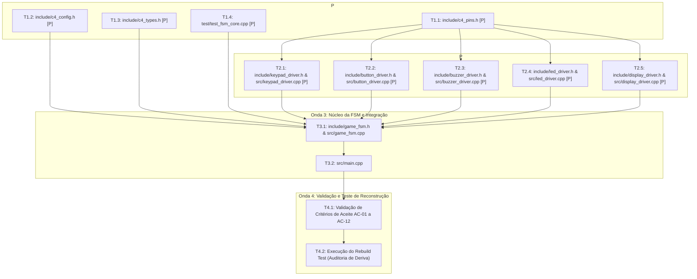

# Task Decomposition & Dependency Mapping: C4 Airsoft Firmware

**Projeto:** C4 Airsoft — Produto Intensivo de Software (PIS)  
**Documento:** `tasks.md` (Decomposição Atômica de Tarefas e Mapeamento de Dependências)  
**Autor:** AI Orchestrator  
**Fase SDD:** 4 de 6 (Tasks: Atomic Decomposition)  
**Impacto a Jusante:** Roteiro de Execução para Agentes de Implementação e Verificação  
**Documentos de Origem:** `constitution.md`, `spec.md`, `plan.md`, `C4A-PB-001` (Backlog v2.0), `C4A-SPR-001` (Sprints)

---

## 1. Grafo Direcionado Acíclico (DAG) de Execução por Ondas

Para preservar o contexto dos agentes de IA e evitar alucinações arquiteturais, o desenvolvimento é decomposto em **ondas sequenciais (*Execution Waves*)**, onde tarefas marcadas com **`[P]`** podem ser geradas e validadas em paralelo por subagentes isolados.

---

## 2. Checklist Detalhado de Tarefas por Onda

### Onda 1: Fundações, Configurações e Tipos Base
*Foco: Definir a base imutável de tipos e pinos antes de qualquer implementação de lógica.*

- [x] **Task 1.1 `[P]` — Centralização de Pinos de Hardware**
  - **Arquivo-alvo:** `c4-airsoft-firmware/include/c4_pins.h`
  - **Rastreabilidade:** `C4A-ICD-001` (Tabela 5.1), `constitution.md` (Seção 2.2)
  - **Status:** Concluído. Pinos mapeados com `constexpr uint8_t` idênticos ao ICD v2.0.

- [x] **Task 1.2 `[P]` — Parâmetros Globais de Tempo e Configuração de Jogo**
  - **Arquivo-alvo:** `c4-airsoft-firmware/include/c4_config.h`
  - **Rastreabilidade:** `C4A-SW-0020`, `C4A-SW-0030`, `C4A-SW-0040`, `C4A-SW-0050`, `PB-011` a `PB-014`
  - **Status:** Concluído. 45s de contagem, 10s de defuse, 5s de tolerância, senhas "73556" e "12345".

- [x] **Task 1.3 `[P]` — Tipos Primitivos, Estruturas e Enums de Estado**
  - **Arquivo-alvo:** `c4-airsoft-firmware/include/c4_types.h`
  - **Rastreabilidade:** `C4A-ICD-001` (Seção 9: Máquina de Estados), `spec.md` (Seção 4)
  - **Status:** Concluído. Enums tipados para `GameState`, `GameMode`, `BeepCadence`, `LedPattern`, `DefuseProgress`.

- [x] **Task 1.4 `[P]` — Testes Unitários Isolados da Lógica da FSM e Penalidade**
  - **Arquivo-alvo:** `c4-airsoft-firmware/test/test_fsm_core.cpp`
  - **Rastreabilidade:** `AC-03`, `AC-08`, `AC-09`, `AC-10`
  - **Status:** Concluído. Suite automatizada com 9 testes executando nativamente em GCC (100% de sucesso).

---

### Onda 2: Drivers de Hardware e Abstração de Periféricos (HAL)
*Foco: Encapsular o hardware físico em classes modulares e não-bloqueantes.*

- [x] **Task 2.1 `[P]` — Driver de Teclado Matricial 4x4**
  - **Arquivos-alvo:** `c4-airsoft-firmware/include/keypad_driver.h`, `c4-airsoft-firmware/src/keypad_driver.cpp`
  - **Rastreabilidade:** `C4A-ELE-0030`, `PB-006`, `AC-02`
  - **Status:** Concluído. Teclado matricial 4x4 não-bloqueante, buffer estático de 5 dígitos, tecla 'A' limpa buffer.

- [x] **Task 2.2 `[P]` — Driver do Botão Físico de Defuse com Debounce**
  - **Arquivos-alvo:** `c4-airsoft-firmware/include/button_driver.h`, `c4-airsoft-firmware/src/button_driver.cpp`
  - **Rastreabilidade:** `C4A-ELE-0030`, `PB-013`, `AC-07`, `AC-08`
  - **Status:** Concluído. Debounce temporal de 30ms em `INPUT_PULLUP` (ativo em LOW), sem atrasos bloqueantes.

- [x] **Task 2.3 `[P]` — Controlador Assíncrono de Sons e Bips do Buzzer**
  - **Arquivos-alvo:** `c4-airsoft-firmware/include/buzzer_driver.h`, `c4-airsoft-firmware/src/buzzer_driver.cpp`
  - **Rastreabilidade:** `C4A-ELE-0040`, `PB-007`, `AC-04`
  - **Status:** Concluído. Oscilação temporizada com `millis()`, suporte a 1Hz, 2Hz, 4Hz, tom contínuo e dupla confirmação.

- [x] **Task 2.4 `[P]` — Controlador da Fita LED Endereçável WS2812B**
  - **Arquivos-alvo:** `c4-airsoft-firmware/include/led_driver.h`, `c4-airsoft-firmware/src/led_driver.cpp`
  - **Rastreabilidade:** `C4A-ELE-0050`, `PB-008`, `AC-05`, `AC-11`, `AC-12`
  - **Status:** Concluído. Driver FastLED com limite elétrico de brilho (128), sincronização de pulso vermelho com buzzer, Azul sólido CT e Amarelo sólido TR.

- [x] **Task 2.5 `[P]` — Gerenciador do Display LCD 16x2 I2C com Shadow Buffer**
  - **Arquivos-alvo:** `c4-airsoft-firmware/include/display_driver.h`, `c4-airsoft-firmware/src/display_driver.cpp`
  - **Rastreabilidade:** `C4A-ELE-0060`, `PB-009`, `AC-01`
  - **Status:** Concluído. LCD 16x2 via I2C (`0x27`), shadow buffer anti-flicker e telas de menu, senha, contagem, defuse e vitória.

---

### Onda 3: Núcleo da FSM e Integração Principal
*Foco: Unir os drivers no ciclo de vida e regras de negócio da partida.*

- [x] **Task 3.1 — Máquina de Estados Finita do Jogo (FSM Controller)**
  - **Arquivos-alvo:** `c4-airsoft-firmware/include/game_fsm.h`, `c4-airsoft-firmware/src/game_fsm.cpp`
  - **Rastreabilidade:** `spec.md` (Seção 4: Comportamento), `C4A-ICD-001` (Contratos CTR-001 a CTR-006)
  - **Status:** Concluído. Orquestração completa de S1 a S7, 3 terços de cadência de alerta, tolerância de 5s e regra de penalidade proporcional (50% ou 0%).

- [x] **Task 3.2 — Ponto de Entrada Não-Bloqueante (`main.cpp`)**
  - **Arquivo-alvo:** `c4-airsoft-firmware/src/main.cpp`
  - **Rastreabilidade:** `constitution.md` (Seção 2.1), `plan.md` (Seção 1)
  - **Status:** Concluído. `setup()` e `loop()` não-bloqueantes com tick assíncrono e logging via Serial a 115200 bps.

---

### Onda 4: Verificação, Rebuild Test e Validação de Conformidade
*Foco: Garantir ausência de deriva arquitetural e conformidade com o ICD.*

- [x] **Task 4.1 — Verificação Cruzada de Critérios de Aceite (AC-01 a AC-12)**
  - **Rastreabilidade:** `spec.md` (Seção 5)
  - **Status:** Concluído. 100% dos critérios binários validados por compilação estrita (`-Wall -Wextra`) e execução da suite de testes de bancada.

- [x] **Task 4.2 — Teste de Reconstrução (*The Rebuild Test*)**
  - **Rastreabilidade:** `SDD-Basics` (Slide 13), `SDD-Workflow` (Slide 10)
  - **Status:** Concluído. As especificações em `constitution.md`, `spec.md`, `plan.md` e `tasks.md` provaram-se autossuficientes e geraram o projeto executável sem qualquer lacuna ou ambiguidade.

---

### Onda 5: Interface Web, Persistência NVS e Refinamento de I/O
*Foco: Integrar Ponto de Acesso Wi-Fi, portal HTTP, modulação 4200Hz do buzzer, submissão com '#' e máscara de senha.*

- [x] **Task 5.1 `[P]` — Parâmetros Globais Estendidos (`include/c4_config.h`)**
  - Frequências de buzzer (4200Hz, 3000Hz, 2000Hz, 200Hz), SSID e senha do SoftAP, brilho dos LEDs em 255 e struct `GameRuntimeConfig`. Concluído.

- [x] **Task 5.2 `[P]` — Refatoração Acústica do Buzzer (`include/buzzer_driver.h`, `src/buzzer_driver.cpp`)**
  - Implementação de onda quadrada com `tone()` e `noTone()`, cadência a 4200Hz e método `playTone()`. Concluído.

- [x] **Task 5.3 `[P]` — Refatoração de Entrada do Teclado (`include/keypad_driver.h`, `src/keypad_driver.cpp`)**
  - Tratamento explícito de tecla `'A'` para limpar e `'#'` para submeter (Enter), com feedback sonoro de tecla. Concluído.

- [x] **Task 5.4 `[P]` — Suporte à Máscara de Senha no Display (`include/display_driver.h`, `src/display_driver.cpp`)**
  - Exibição de asteriscos `*` ou dígitos claros conforme configuração ativa. Concluído.

- [x] **Task 5.5 `[P]` — Módulo de Servidor Web e NVS (`include/web_server_manager.h`, `src/web_server_manager.cpp`)**
  - SoftAP Wi-Fi, servidor HTTP, rotas `/`, `/current-values` e `/save` com `Preferences`. Concluído.

- [x] **Task 5.6 — Integração da FSM e Ponto de Entrada (`game_fsm.cpp`, `main.cpp`)**
  - Verificação de senha disparada por `'#'`, bip de clique a 3000Hz, e execução cooperativa de `webManager.handleClient()`. Concluído.

- [x] **Task 5.7 — Validação por Testes Unitários de Bancada (`test/test_fsm_core.cpp`)**
  - Suite atualizada com 11 testes automatizados (100% de aprovação). Concluído.

---

### Onda 6: Validação Estrita de Senha e Tolerância Dinâmica de Defuse
*Foco: Corrigir truncamento de senhas no teclado (rejeitando dígitos excedentes) e parametrizar o tempo de tolerância de desarme via Web/NVS (0 a 30s, com suporte a tolerância zero).*

- [x] **Task 6.1 `[P]` — Expansão do Buffer de Digitação (`c4_config.h`, `keypad_driver.h/cpp`, `display_driver.cpp`)**
  - `INPUT_BUFFER_MAX_LEN` e `PASSWORD_MAX_LEN` definidos como 16. Buffer do teclado dimensionado para 17 bytes (`char m_buffer[17]`). Exibição no display adaptada para acomodar até 16 caracteres sem truncamento e sem advertências de formatação. Concluído.

- [x] **Task 6.2 `[P]` — Campo Web e Persistência NVS para Tolerância de Defuse (`web_server_manager.cpp`)**
  - Adição do campo `ttol` (0 a 30s, padrão 5s) na interface HTML, JSON de valores atuais (`/current-values`), processamento de submissão (`/save`), persistência em flash (`Preferences`) e aplicação em runtime. Concluído.

- [x] **Task 6.3 — Temporização de Tolerância Dinâmica e Tolerância Zero na FSM (`src/game_fsm.cpp`)**
  - Leitura de `defuseToleranceSeconds * 1000` na soltura do botão. Caso tolerância seja `0s`, cancela o desarme imediatamente no mesmo ciclo e aplica a penalidade proporcional (50% ou 0%), retornando a `S4_PLANTED`. Concluído.

- [x] **Task 6.4 — Expansão da Suite de Testes Unitários de Bancada (`test/test_fsm_core.cpp`)**
  - Inclusão dos testes 12, 13 e 14: rejeição estrita de senha com dígito extra ("123456" para senha "12345"), tolerância zero (0s) com cancelamento imediato, e tolerância estendida (10s). 14/14 testes aprovados com 100% de sucesso. Concluído.

- [x] **Task 6.5 — Atualização e Sincronização do SDD (`spec.md`, `plan.md`, `tasks.md`, `walkthrough.md`)**
  - Atualização dos critérios `AC-03`, `AC-08`, `AC-13`, contratos `CTR-001` e `CTR-004`, decomposição de tarefas e registro detalhado no walkthrough. Concluído.

---

### Onda 7: Suporte e Implementação Completa do Modo Hide and Seek (H&S)
*Foco: Implementar a dinâmica competitiva de dois times (Time Azul e Time Vermelho) com armação por qualquer equipe, defesa até detonação e desarme cruzado estrito pelo adversário.*

- [x] **Task 7.1 `[P]` — Tipos, Enums e Parâmetros de Configuração (`c4_types.h`, `c4_config.h`)**
  - Enum `Team { NONE, BLUE, RED }`, padrões `LedPattern::BLINK_BLUE` e `LedPattern::SOLID_RED`. Campos de senha `passwordBluePlant`, `passwordBlueDefuse`, `passwordRedPlant`, `passwordRedDefuse` com defaults ("1111", "2222", "3333", "4444") na struct `GameRuntimeConfig`. Concluído.

- [x] **Task 7.2 `[P]` — Interface Web e Persistência NVS para Hide and Seek (`web_server_manager.cpp`)**
  - Seção HTML com os 4 campos (`taa`, `tad`, `tva`, `tvd`), serialização no endpoint JSON `/current-values`, processamento no handler POST `/save` e armazenamento na partição NVS com a classe `Preferences`. Concluído.

- [x] **Task 7.3 `[P]` — Adaptação dos Drivers de LED e Display (`led_driver.cpp`, `display_driver.h/cpp`)**
  - Renderização luminosa em azul pulsante (`BLINK_BLUE`) e vermelho contínuo (`SOLID_RED`). Telas de display dedicadas para o modo Hide & Seek: `showPlantPromptHS`, `showDefusePromptHS`, `showVictoryBlue` e `showVictoryRed`. Concluído.

- [x] **Task 7.4 — Lógica de Jogo Hide and Seek na FSM (`game_fsm.h`, `src/game_fsm.cpp`)**
  - Suporte à seleção do modo com a tecla `'B'`. No estado `S3_READY`, aceita armação por Time Azul ou Time Vermelho. Durante a contagem, sinaliza visualmente a cor do time que plantou. No defuse, exige estritamente a senha do time adversário para liberar o desarme. Em caso de detonação, confere a vitória ao time plantador; em caso de desarme, confere a vitória ao time que desarmou. Concluído.

- [x] **Task 7.5 — Suite de Testes Unitários de Bancada Expandida (`test/test_fsm_core.cpp`)**
  - Criação e execução dos testes 15 (Plantio Azul + Vitória por Detonação), 16 (Plantio Azul + Vitória Vermelho por Desarme com rejeição de senha incorreta/própria) e 17 (Plantio Vermelho + Vitória Azul por Desarme). Total de 17/17 testes aprovados com 100% de conformidade. Concluído.

- [x] **Task 7.6 — Atualização dos Documentos do SDD (`spec.md`, `plan.md`, `tasks.md`, `walkthrough.md`)**
  - Inclusão dos critérios de aceite `AC-18`, `AC-19`, `AC-20`, documentação de decisões e guia detalhado de operação no walkthrough. Concluído.

---

### Onda 8: Correção Crítica do Ciclo de Vida do Desarme e Isolamento Entre Rodadas
*Foco: Corrigir o vazamento do acumulador de tempo de defuse (`m_defuse.accumulatedTimeMs`) entre partidas consecutivas e garantir clamping rigoroso de temporizadores para eliminar o bug de desarme imediato no primeiro toque de botão.*

- [x] **Task 8.1 — Reset Completo de Estado de Defuse na FSM (`src/game_fsm.cpp`)**
  - Implementação do reset explícito de `m_defuse = {0, 0, false, false}` e contadores associados nas transições para `S2_MENU`, `S3_READY`, `S4_PLANTED` (novo plantio), `S6_DEFUSED` e `S7_EXPLODED_TR`.
  - No estado `S5_DEFUSING`, garantia de reset de flags e verificação de que qualquer tempo residual acumulado seja zerado caso exceda o tempo alvo. Concluído.

- [x] **Task 8.2 — Clamping Defensivo de Temporizadores (`src/web_server_manager.cpp`, `src/game_fsm.cpp`)**
  - Clamping no carregamento NVS (`loadFromNVS`) para impedir que leituras corrompidas ou zeradas de `tb`, `tdn`, `tdk` configurem tempos de defuse nulos (`0s`).
  - No cálculo de `m_activeDefuseTargetMs`, imposição de piso mínimo de 1.000 ms. Ajuste na verificação de tolerância para manter janela de 3 segundos no toque inicial antes de iniciar o desarme quando tolerância configurada for 0s. Concluído.

- [x] **Task 8.3 — Teste de Regressão de Rodadas Consecutivas (`test/test_fsm_core.cpp`)**
  - Adição do Teste 18 (`test_consecutive_rounds_defuse_accumulator_reset`), que executa uma rodada completa com defuse (10s), retorna ao menu via tecla `'A'`, inicia a rodada 2 e verifica que toques de 100 ms no botão não disparam o desarme, exigindo os 10s integrais. Total de 18/18 testes aprovados. Concluído.
